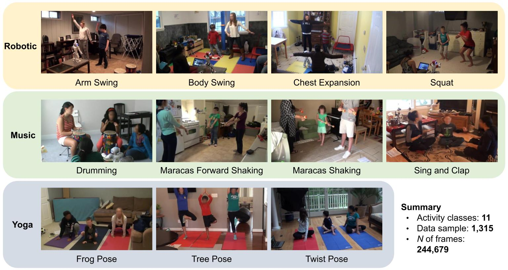
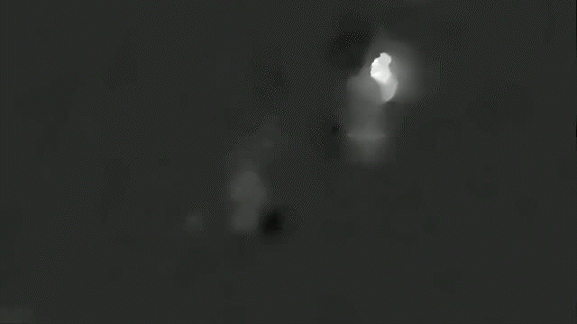

# MMASD-A-Multimodal-Dataset-for-Autism-Intervention-Analysis

This is the repository for MMASD: A Multimodal Dataset for Autism Intervention Analysis.

### Row 1
Caption for row 1

   

### Row 2
Caption for row 2

   

### Row 3
Caption for row 3

  

We presents a novel privacy-preserving open-source dataset, MMASD as a Multi Modal ASD benchmark dataset, collected from play therapy interventions of children with Autism. 
MMASD includes data from 32 children with ASD, and 1,315 data samples segmented from over 100 hours of intervention recordings.
It covers 11 different activities in 3 themes, and consists of four privacy-preserving modalities of data: 

- (1) Optical flow: derived from raw RGB video, for each frame, we have **_x.jpg and **_y.jpg, representing the horizontal and vertical components, respectively

<table>
  <tr>
     <td>
      <table>
        <caption>video</caption>
        <tr>
          <td></td>
        </tr>
      </table>
    </td>
    <td>
      <table>
        <caption>x-component</caption>
        <tr>
          <td></td>
        </tr>
      </table>
    </td>
    <td>
      <table>
        <caption>y-component</caption>
        <tr>
          <td></td>
        </tr>
      </table>
    </td>
  </tr>
</table>

- (2) 2D skeleton: generated via OpenPose, 25 body keypoints. For detailed keypoints information, please refer to https://cmu-perceptual-computing-lab.github.io/openpose/web/html/doc/md_doc_02_output.html#pose-output-format-body_25.

<table>
  <tr>
    <td>
      <table>
        <caption>video</caption>
        <tr>
          <td></td>
        </tr>
      </table>
    </td>
    <td>
      <table>
        <caption>2D skeleton</caption>
        <tr>
          <td></td>
        </tr>
      </table>
    </td>
  </tr>
</table>

- (3) 3D skeleton: generated via Regression of Multiple 3D People (ROMP), 71 body keypoints. The 71 joints are 24 SMPL joints + 30 extra joints + 17 h36m joints. For details please refer to https://github.com/Arthur151/ROMP/blob/master/simple_romp/README.md.

<table>
  <tr>
    <td>
      <table>
        <caption>video</caption>
        <tr>
          <td></td>
        </tr>
      </table>
    </td>
    <td>
      <table>
        <caption>3D skeleton</caption>
        <tr>
          <td></td>
        </tr>
      </table>
    </td>
  </tr>
</table>

- (4) Clinician ASD evaluation scores of children, including demographic information (age, gender, etc.) and autism related evaluation scores such as ADOS-2.

Due to the file size limit, we have uploaded the data to google drive, which can be easily accessed at https://tinyurl.com/mr3rd2dp.

# Reference:

OpenPose: https://github.com/CMU-Perceptual-Computing-Lab/openpose

ROMP: https://github.com/Arthur151/ROMP

